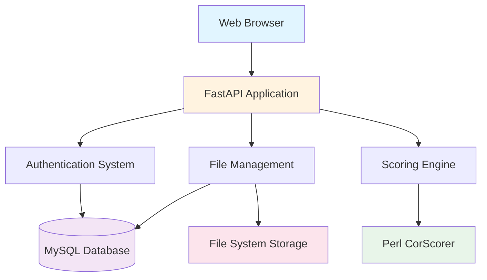

# 🎯 Discourse Resolution Evaluation System

<div align="center">


**A comprehensive web-based platform for evaluating discourse resolution (coreference) systems using industry-standard metrics across multiple languages.**

[Features](#-features) • [Installation](#-installation) • [Usage](#-usage-guide) • [Documentation](#-api-documentation) • [Support](#-support)

</div>

---

## 📋 Table of Contents

- [Overview](#-overview)
- [Features](#-features)
- [System Architecture](#-system-architecture)
- [Installation](#-installation)
- [Configuration](#%EF%B8%8F-configuration)
- [Usage Guide](#-usage-guide)
- [Evaluation Metrics](#-evaluation-metrics)
- [Project Structure](#-project-structure)
- [API Documentation](#-api-documentation)
- [Troubleshooting](#-troubleshooting)
- [Contributing](#-contributing)
- [License](#-license)
- [Acknowledgments](#-acknowledgments)

---

## 🎯 Overview

The **Discourse Resolution Evaluation System** is a FastAPI-based web application designed for researchers and practitioners working on coreference resolution. It provides automated evaluation of system outputs against gold standard datasets using multiple standardized metrics.

### 💡 What is Coreference Resolution?

Coreference resolution is the task of identifying when different expressions in text refer to the same real-world entity. 

**Example:**
```
"John went to the store. He bought milk."
```
The system needs to recognize that **"He"** refers to **"John"**.

### 🌟 Why This System?

| Feature | Description |
|---------|-------------|
| ✅ **Standardized Evaluation** | Uses industry-standard metrics (MUC, B-CUBED, CEAF, BLANC) |
| 🌍 **Multi-language Support** | Evaluate systems across different languages |
| ⚡ **Real-time Results** | Get instant feedback on your system's performance |
| 🏆 **Leaderboard** | Compare your results with other participants |
| 🎨 **Easy to Use** | Simple web interface for uploading and evaluating files |

---

## ✨ Features

### 👥 For Participants

<table>
<tr>
<td width="50%">

#### 📤 File Upload & Evaluation
- Upload system output files (.txt format)
- Instant scoring using Perl-based CorScorer
- Support for multiple languages

</td>
<td width="50%">

#### 📊 Comprehensive Metrics
- **MUC** - Link-based evaluation
- **B-CUBED** - Mention-based evaluation
- **CEAF-M/E** - Entity alignment
- **BLANC** - Bilateral assessment

</td>
</tr>
<tr>
<td width="50%">

#### 📈 Evaluation History
- Track all submissions
- View historical scores
- Download past results

</td>
<td width="50%">

#### 🏆 Leaderboard
- Public rankings per language
- Compare with other systems
- Track your progress

</td>
</tr>
</table>

### 🔐 For Administrators

<table>
<tr>
<td>

- **👤 User Management** - Create and manage participant accounts
- **🌐 Language Configuration** - Add, edit, or remove supported languages
- **📁 Gold Dataset Management** - Upload and manage reference datasets
- **📊 System Monitoring** - View statistics and activity logs
- **🎯 Leaderboard Control** - Manage public rankings and scores

</td>
</tr>
</table>

### 🌐 Public Features

- 🏠 **Homepage Leaderboard** - View top-performing systems
- 📊 **Statistics Dashboard** - Overall participation metrics
- 📱 **Responsive Design** - Works on desktop and mobile

---

## 🏗️ System Architecture


<details>
<summary><b>📐 Architecture Details (Click to expand)</b></summary>
```
┌─────────────────────────────────────────────────────────────┐
│                        Web Browser                           │
│              (HTML/CSS/JavaScript Interface)                 │
└────────────────────┬────────────────────────────────────────┘
                     │
                     ▼
┌─────────────────────────────────────────────────────────────┐
│                    FastAPI Application                       │
│                    (Python Backend)                          │
│  ┌──────────────┐  ┌──────────────┐  ┌──────────────┐     │
│  │ Auth System  │  │   File       │  │   Scoring    │     │
│  │  (bcrypt)    │  │  Management  │  │   Engine     │     │
│  └──────────────┘  └──────────────┘  └──────────────┘     │
└────────────────────┬──────────────┬─────────────────────────┘
                     │              │
                     ▼              ▼
        ┌────────────────────┐  ┌──────────────────┐
        │  MySQL Database    │  │  Perl CorScorer  │
        │  (User data,       │  │  (Evaluation)    │
        │   Scores, etc.)    │  │                  │
        └────────────────────┘  └──────────────────┘
                     │
                     ▼
        ┌────────────────────────────────────┐
        │      File System Storage            │
        │  • uploads/         (user files)    │
        │  • gold_datasets/   (reference)     │
        │  • scorer/          (Perl scripts)  │
        └────────────────────────────────────┘
```

</details>

---

## 🚀 Installation

### 📋 Prerequisites

Before installing, ensure you have the following:

| Software | Version | Purpose | Installation Link |
|----------|---------|---------|-------------------|
| 🐍 **Python** | 3.8+ | Backend runtime | [python.org](https://www.python.org/downloads/) |
| 🗄️ **MySQL** | 8.0+ | Database | [mysql.com](https://dev.mysql.com/downloads/) |
| 📜 **Perl** | 5.x | Scoring engine | [Windows](https://strawberryperl.com/) / [Linux/Mac](https://www.perl.org/get.html) |

#### 🔧 Required Perl Modules
```bash
cpan install Algorithm::Munkres
cpan install Math::Combinatorics
```

---

### 📥 Step-by-Step Installation

#### **Step 1: Clone or Download the Repository**
```bash
# Option A: Clone with git
git clone <repository-url>
cd discourse-evaluation-system

# Option B: Download and extract ZIP file
# Then navigate to the extracted folder
```

#### **Step 2: Set Up Python Virtual Environment**
```bash
# Create virtual environment
python -m venv venv

# Activate virtual environment
# Windows:
venv\Scripts\activate

# Linux/Mac:
source venv/bin/activate
```

#### **Step 3: Install Python Dependencies**
```bash
pip install fastapi uvicorn python-multipart jinja2 mysql-connector-python bcrypt
```

<details>
<summary><b>📦 Alternative: Using requirements.txt (Click to expand)</b></summary>

Create a `requirements.txt` file:
```txt
fastapi>=0.68.0
uvicorn>=0.15.0
python-multipart>=0.0.5
jinja2>=3.0.0
mysql-connector-python>=8.0.0
bcrypt>=3.2.0
```

Then install:
```bash
pip install -r requirements.txt
```

</details>

#### **Step 4: Set Up MySQL Database**

<details>
<summary><b>🗄️ Database Setup SQL (Click to expand)</b></summary>
```sql
-- Open MySQL command line or MySQL Workbench
-- Create database
CREATE DATABASE coref_eval_system;

-- Create user (change credentials as needed)
CREATE USER 'harsh'@'localhost' IDENTIFIED BY 'harsh';
GRANT ALL PRIVILEGES ON coref_eval_system.* TO 'harsh'@'localhost';
FLUSH PRIVILEGES;

-- Use the database
USE coref_eval_system;

-- Create users table
CREATE TABLE users (
    id INT AUTO_INCREMENT PRIMARY KEY,
    username VARCHAR(100) UNIQUE NOT NULL,
    email VARCHAR(255) UNIQUE NOT NULL,
    password_hash VARCHAR(255) NOT NULL,
    is_active BOOLEAN DEFAULT TRUE,
    created_at TIMESTAMP DEFAULT CURRENT_TIMESTAMP
);

-- Create languages table
CREATE TABLE languages (
    id INT AUTO_INCREMENT PRIMARY KEY,
    language_code VARCHAR(10) UNIQUE NOT NULL,
    language_name VARCHAR(100) NOT NULL,
    created_at TIMESTAMP DEFAULT CURRENT_TIMESTAMP
);

-- Create gold_datasets table
CREATE TABLE gold_datasets (
    id INT AUTO_INCREMENT PRIMARY KEY,
    language_id INT NOT NULL,
    filename VARCHAR(255) NOT NULL,
    file_path VARCHAR(500) NOT NULL,
    uploaded_by VARCHAR(100),
    created_at TIMESTAMP DEFAULT CURRENT_TIMESTAMP,
    FOREIGN KEY (language_id) REFERENCES languages(id) ON DELETE CASCADE
);

-- Create user_evaluations table
CREATE TABLE user_evaluations (
    id INT AUTO_INCREMENT PRIMARY KEY,
    user_id INT NOT NULL,
    language_id INT NOT NULL,
    uploaded_filename VARCHAR(255) NOT NULL,
    file_path VARCHAR(500) NOT NULL,
    muc_recall DECIMAL(10,4),
    muc_precision DECIMAL(10,4),
    muc_f1 DECIMAL(10,4),
    bcub_recall DECIMAL(10,4),
    bcub_precision DECIMAL(10,4),
    bcub_f1 DECIMAL(10,4),
    ceafm_recall DECIMAL(10,4),
    ceafm_precision DECIMAL(10,4),
    ceafm_f1 DECIMAL(10,4),
    ceafe_recall DECIMAL(10,4),
    ceafe_precision DECIMAL(10,4),
    ceafe_f1 DECIMAL(10,4),
    blanc_recall DECIMAL(10,4),
    blanc_precision DECIMAL(10,4),
    blanc_f1 DECIMAL(10,4),
    created_at TIMESTAMP DEFAULT CURRENT_TIMESTAMP,
    FOREIGN KEY (user_id) REFERENCES users(id),
    FOREIGN KEY (language_id) REFERENCES languages(id)
);
```

</details>

#### **Step 5: Configure Database Connection**

Edit the `DB_CONFIG` section in `main.py`:
```python
DB_CONFIG = {
    'host': 'localhost',
    'database': 'coref_eval_system',
    'user': 'harsh',        # 👈 Change to your MySQL username
    'password': 'harsh'     # 👈 Change to your MySQL password
}
```

#### **Step 6: Set Up Scorer Files**

1. Create the `scorer` directory in your project root
2. Download CorScorer from the official source
3. Place these files in `scorer/` directory:
   - `scorer.pl` - Main scoring script
   - `CorScorer.pm` - Perl module for scoring
   - Any other required Perl modules

> **📝 Note**: The CorScorer package should be obtained from the official CoNLL shared task or SemEval repositories.

#### **Step 7: Verify Installation**
```bash
# Test database connection
python -c "import mysql.connector; print('✅ MySQL OK')"

# Test Perl
perl -v

# Test Perl modules
perl -e "use Algorithm::Munkres; print '✅ Munkres OK\n';"
perl -e "use Math::Combinatorics; print '✅ Combinatorics OK\n';"
```

---

## ⚙️ Configuration

### 🔐 Database Configuration

Edit `main.py` to match your MySQL setup:
```python
DB_CONFIG = {
    'host': 'localhost',      # Database host
    'database': 'coref_eval_system',  # Database name
    'user': 'harsh',          # Your MySQL username
    'password': 'harsh'       # Your MySQL password
}
```

### 🌍 Environment Variables (Production)

For production deployment, use environment variables:
```python
import os

DB_CONFIG = {
    'host': os.getenv('DB_HOST', 'localhost'),
    'database': os.getenv('DB_NAME', 'coref_eval_system'),
    'user': os.getenv('DB_USER', 'harsh'),
    'password': os.getenv('DB_PASSWORD', 'harsh')
}
```

### 🎭 Demo Mode

The system includes a demo mode that works without a database:

| User Type | Username | Password |
|-----------|----------|----------|
| 👨‍💼 Admin | `admin` | `admin123` |
| 👤 Regular User | `testuser` | `user123` |

**Demo Languages:**
- 🇮🇳 Hindi (hi)
- 🇬🇧 English (en)

> Demo mode automatically activates if database connection fails.

---

## 📖 Usage Guide

### 🚀 Starting the Server
```bash
# 1. Activate virtual environment
# Windows:
venv\Scripts\activate
# Linux/Mac:
source venv/bin/activate

# 2. Start the server
python main.py

# 3. Access the application
# Open browser and navigate to: http://localhost:8000
```

**Expected Output:**
```
Starting Coreference Evaluation System...
Demo credentials:
  Admin: admin/admin123
  User: testuser/user123
Access at: http://localhost:8000

System checks:
  ✅ Perl available: True
  ✅ Database connection: OK
```

---

### 👥 For Participants

#### 🔐 **Step 1: Login**

1. Navigate to `http://localhost:8000/login`
2. Enter your credentials (or use demo credentials)
3. Click **"Sign In"**

<kbd></kbd>

#### 📤 **Step 2: Upload Files for Evaluation**

1. **Select Language** from the dropdown menu
2. **Choose File** - Click and select your system output file (.txt format)
3. **Evaluate** - Click "Evaluate File" button
4. **Wait** - Processing typically takes 10-60 seconds
5. **View Results** - Scores appear in the results panel

<kbd></kbd>

#### 📊 **Step 3: View History**

- Your evaluation history appears on the right side
- Shows: Date, filename, language, and all metric scores
- Automatically updates after each evaluation

<kbd></kbd>

#### 🏆 **Step 4: View Leaderboard**

- Visit the homepage to see public leaderboards
- Rankings are per language
- Shows your best score for each language

---

### 🔐 For Administrators

#### 🎛️ **Access Admin Panel**

1. Login with admin credentials
2. Automatically redirected to `/admin`

#### 🌐 **Add New Languages**

1. Go to **"Language Management"** tab
2. Enter **language code** (e.g., "fr" for French)
3. Enter **full language name** (e.g., "French")
4. Click **"Add Language"**

<kbd></kbd>

#### 📁 **Upload Gold Datasets**

1. Go to **"Gold Datasets"** tab
2. Select language from dropdown
3. Choose your reference file (.txt format)
4. Click **"Upload Dataset"**

> ⚠️ **Important**: Each language must have a gold dataset before participants can evaluate files.

#### 👤 **Manage Users**

1. Go to **"User Management"** tab
2. Fill in username, email, and password
3. Click **"Add User"**
4. Users can then login with their credentials

---

### 📄 File Format Requirements

#### 📝 System Output Files (.txt)

Your system output must follow the CoNLL/SemEval coreference format:
```
#begin document (doc_id);
doc_id    0    0    John    (1)
doc_id    0    1    went    -
doc_id    0    2    to    -
doc_id    0    3    the    (2
doc_id    0    4    store    2)
doc_id    0    5    .    -
doc_id    1    0    He    (1)
doc_id    1    1    bought    -
doc_id    1    2    milk    (3)
doc_id    1    3    .    -
#end document
```

**Format Details:**

| Column | Description | Example |
|--------|-------------|---------|
| 1 | Document ID | `doc_id` |
| 2 | Part number | `0`, `1`, etc. |
| 3 | Token number | `0`, `1`, `2`, etc. |
| 4 | Word/Token | `John`, `went`, etc. |
| 5 | Coreference | `(1)`, `(2`, `2)`, `-` |

**Coreference Annotations:**
- `(1)` - Singleton mention in chain 1
- `(2` - Mention starts in chain 2
- `2)` - Mention ends in chain 2
- `-` - No coreference annotation

#### 📚 Gold Dataset Files (.txt)

Gold datasets follow the same format as system output files. They represent the correct/reference coreference annotations.

---

## 📊 Evaluation Metrics

The system provides **five** standard coreference evaluation metrics:

### 1️⃣ MUC (Message Understanding Conference)

<table>
<tr>
<td width="30%"><b>📌 What it measures</b></td>
<td>Focuses on the number of links correctly identified between mentions in the same coreference chain</td>
</tr>
<tr>
<td><b>🧮 Formula</b></td>
<td>Based on the minimum number of links needed to form clusters</td>
</tr>
<tr>
<td><b>✅ Best for</b></td>
<td>Systems that aim to connect mentions accurately</td>
</tr>
</table>

### 2️⃣ B-CUBED (B³)

<table>
<tr>
<td width="30%"><b>📌 What it measures</b></td>
<td>Evaluates each mention individually and rewards correct placement in coreference chains</td>
</tr>
<tr>
<td><b>🧮 Formula</b></td>
<td>Averages precision and recall over all mentions</td>
</tr>
<tr>
<td><b>✅ Best for</b></td>
<td>Getting fine-grained per-mention accuracy</td>
</tr>
</table>

### 3️⃣ CEAF-M (Mention-based)

<table>
<tr>
<td width="30%"><b>📌 What it measures</b></td>
<td>Optimal alignment between system and gold mention sets</td>
</tr>
<tr>
<td><b>🧮 Formula</b></td>
<td>Uses Kuhn-Munkres algorithm for optimal matching</td>
</tr>
<tr>
<td><b>✅ Best for</b></td>
<td>Balanced evaluation of mention identification and clustering</td>
</tr>
</table>

### 4️⃣ CEAF-E (Entity-based)

<table>
<tr>
<td width="30%"><b>📌 What it measures</b></td>
<td>Similar to CEAF-M but focuses on entity-level similarity</td>
</tr>
<tr>
<td><b>🧮 Formula</b></td>
<td>Aligns entities (clusters) rather than individual mentions</td>
</tr>
<tr>
<td><b>✅ Best for</b></td>
<td>Systems focused on entity-level coreference</td>
</tr>
</table>

### 5️⃣ BLANC

<table>
<tr>
<td width="30%"><b>📌 What it measures</b></td>
<td>Evaluates both coreference and non-coreference links</td>
</tr>
<tr>
<td><b>🧮 Formula</b></td>
<td>F-score of coreference links combined with F-score of non-coreference links</td>
</tr>
<tr>
<td><b>✅ Best for</b></td>
<td>Comprehensive evaluation including correct separation of non-coreferent mentions</td>
</tr>
</table>

---

### 📈 Understanding the Scores

Each metric provides **three values**:

| Metric | Description | Range |
|--------|-------------|-------|
| 📊 **Recall** | Percentage of correct links/mentions found | 0.0 - 1.0 |
| 🎯 **Precision** | Percentage of predicted links/mentions that are correct | 0.0 - 1.0 |
| ⭐ **F1 Score** | Harmonic mean of recall and precision | 0.0 - 1.0 |

#### Score Interpretation:
```
🟢 1.0 = Perfect     ► All predictions are correct
🟡 0.5 = Moderate    ► Half of the predictions are correct
🔴 0.0 = Poor        ► No correct predictions
```

---

## 📁 Project Structure
```
discourse-evaluation-system/
│
├── 📄 main.py                          # Main FastAPI application
│   ├── Database configuration
│   ├── Authentication & sessions
│   ├── File upload handling
│   ├── Perl scorer integration
│   ├── Route handlers
│   └── Demo mode functionality
│
├── 📁 templates/                       # HTML templates (Jinja2)
│   ├── 🏠 homepage.html               # Public homepage with leaderboards
│   ├── 🔐 login.html                  # Login page
│   ├── 👤 client_dashboard.html      # Participant dashboard
│   └── 🔧 admin_dashboard.html       # Admin control panel
│
├── 📁 uploads/                        # User-uploaded system output files
│   └── [user_id]_[timestamp]_[filename].txt
│
├── 📁 gold_datasets/                  # Reference datasets
│   ├── 📂 lang_1/                    # Language-specific folders
│   │   └── [timestamp]_[filename].txt
│   ├── 📂 lang_2/
│   └── ...
│
├── 📁 scorer/                         # Perl scoring scripts
│   ├── 📜 scorer.pl                  # Main scoring script
│   ├── 📜 CorScorer.pm              # Perl module
│   └── [other Perl dependencies]
│
├── 📁 venv/                          # Python virtual environment
│   ├── Scripts/  (Windows)
│   ├── bin/      (Linux/Mac)
│   └── Lib/
│
├── 📄 requirements.txt               # Python dependencies
│
└── 📘 README.md                      # This file
```

### 📌 Key Files Explained

| File/Folder | Purpose |
|-------------|---------|
| `main.py` | Core application with all backend logic, database operations, and API endpoints |
| `templates/` | Frontend HTML pages styled with embedded CSS and JavaScript |
| `uploads/` | Temporary storage for participant submissions |
| `gold_datasets/` | Organized by language, contains reference datasets for evaluation |
| `scorer/` | Contains Perl-based CorScorer package for metric calculation |

---

## 🔌 API Documentation

### 🔐 Authentication Endpoints

#### `POST /login`

Login to the system.

**Parameters:**
```json
{
  "username": "string (required)",
  "password": "string (required)"
}
```

**Response:**
- Success: Redirect to `/client` or `/admin`
- Error: Login page with error message

---

#### `GET /logout`

Logout and clear session.

**Response:** Redirect to `/`

---

### 👤 Client Endpoints

#### `GET /client`

Access participant dashboard.

**Authentication:** Required

**Response:** HTML dashboard with evaluation form and history

---

#### `POST /evaluate`

Submit file for evaluation.

**Authentication:** Required

**Parameters:**
```json
{
  "language_id": "integer (required)",
  "file": "file upload (required, .txt only)"
}
```

**Response:**
```json
{
  "success": true,
  "scores": {
    "muc": {
      "recall": 0.85,
      "precision": 0.82,
      "f1": 0.835
    },
    "bcub": {
      "recall": 0.78,
      "precision": 0.80,
      "f1": 0.79
    },
    "ceafm": {
      "recall": 0.75,
      "precision": 0.77,
      "f1": 0.76
    },
    "blanc": {
      "recall": 0.88,
      "precision": 0.85,
      "f1": 0.865
    }
  },
  "message": "Evaluation completed successfully"
}
```

---

### 🔧 Admin Endpoints

#### `GET /admin`

Access admin dashboard.

**Authentication:** Admin only

**Response:** HTML admin panel

---

#### `POST /admin/add_language`

Add new language.

**Authentication:** Admin only

**Parameters:**
```json
{
  "language_code": "string (required, max 10 chars)",
  "language_name": "string (required)"
}
```

**Response:** Redirect to `/admin`

---

#### `POST /admin/upload_gold_dataset`

Upload gold dataset for a language.

**Authentication:** Admin only

**Parameters:**
```json
{
  "language_id": "integer (required)",
  "file": "file upload (required, .txt only)"
}
```

**Response:** Redirect to `/admin`

---

#### `POST /admin/add_user`

Create new participant account.

**Authentication:** Admin only

**Parameters:**
```json
{
  "username": "string (required)",
  "email": "string (required)",
  "password": "string (required)"
}
```

**Response:** Redirect to `/admin`

---

### 🌐 Public Endpoints

#### `GET /`

Homepage with statistics and leaderboards.

**Response:** HTML homepage with:
- Language statistics
- Participant count
- Evaluation count
- Per-language leaderboards

---

## 🔧 Troubleshooting

### 🚨 Common Issues and Solutions

<details>
<summary><b>❌ Issue 1: "Perl not installed" Error</b></summary>

**Symptoms:** Error message when trying to evaluate files

**Solution:**
```bash
# Windows: Install Strawberry Perl
# Download from https://strawberryperl.com/

# Linux:
sudo apt-get install perl

# Mac:
brew install perl

# Verify installation
perl -v
```

</details>

<details>
<summary><b>❌ Issue 2: "Missing Perl modules" Error</b></summary>

**Symptoms:** Error about `Math::Combinatorics` or `Algorithm::Munkres`

**Solution:**
```bash
# Install via CPAN
cpan install Algorithm::Munkres
cpan install Math::Combinatorics

# Or via cpanm (recommended)
cpanm Algorithm::Munkres
cpanm Math::Combinatorics
```

</details>

<details>
<summary><b>❌ Issue 3: Database Connection Failed</b></summary>

**Symptoms:** System runs in demo mode, no real data saved

**Solution:**
```bash
# Check MySQL is running
# Windows:
services.msc  # Look for MySQL service

# Linux:
sudo systemctl status mysql

# Test connection:
mysql -u harsh -p
# Enter password and verify connection

# Update credentials in main.py if needed
```

</details>

<details>
<summary><b>❌ Issue 4: "Scorer script not found" Error</b></summary>

**Symptoms:** Evaluation fails with missing scorer.pl

**Solution:**

1. Ensure `scorer/` directory exists in project root
2. Download CorScorer from official source
3. Place `scorer.pl` and `CorScorer.pm` in `scorer/` directory
4. Verify files:
```bash
   ls scorer/
   # Should show: scorer.pl  CorScorer.pm
```

</details>

<details>
<summary><b>❌ Issue 5: Port 8000 Already in Use</b></summary>

**Symptoms:** "Address already in use" error when starting

**Solution:**
```bash
# Find process using port 8000
# Windows:
netstat -ano | findstr :8000

# Linux/Mac:
lsof -i :8000

# Kill the process or use different port
# In main.py, change the last line:
uvicorn.run(app, host="0.0.0.0", port=8001)
```

</details>

<details>
<summary><b>❌ Issue 6: File Upload Fails</b></summary>

**Symptoms:** "Only .txt files allowed" or upload errors

**Solution:**

1. ✅ Ensure file has `.txt` extension
2. ✅ Verify file format matches CoNLL/SemEval format
3. ✅ Check file size (very large files may timeout)
4. ✅ Ensure proper file permissions on `uploads/` directory

</details>

<details>
<summary><b>❌ Issue 7: Scores Show as "N/A"</b></summary>

**Symptoms:** Evaluation completes but scores show N/A

**Solution:**

1. ✅ Check file format is correct
2. ✅ Verify gold dataset exists for selected language
3. ✅ Look at terminal output for Perl script errors
4. ✅ Ensure file encoding is UTF-8

</details>

---

### 🐛 Debug Mode

Enable detailed logging by adding to `main.py`:
```python
import logging
logging.basicConfig(level=logging.DEBUG)
```

This will show detailed information about:
- 📊 Database queries
- 📁 File operations
- 📜 Perl script execution
- ⚠️ Error stack traces

---

## 🤝 Contributing

Contributions are welcome! Here's how you can help:

### 🐞 Reporting Bugs

1. ✅ Check if the issue already exists
2. 📝 Provide detailed description
3. 🔄 Include steps to reproduce
4. 📋 Share error messages and logs